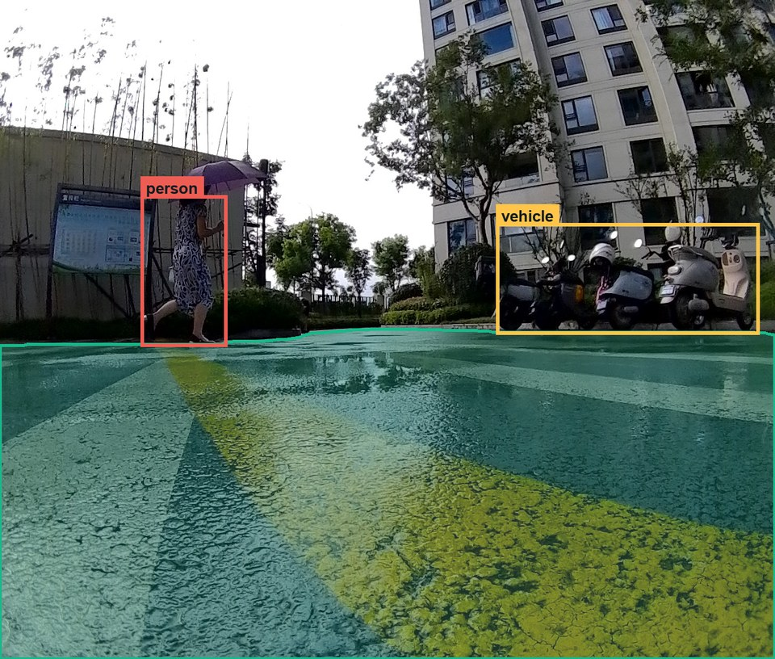
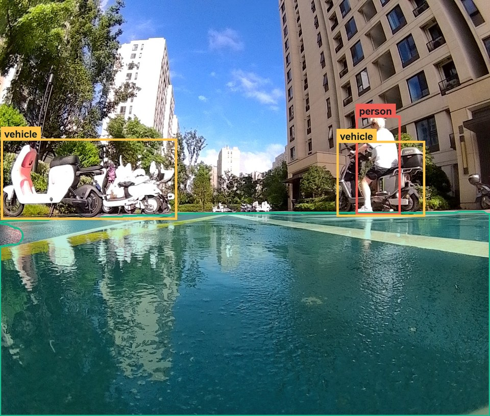
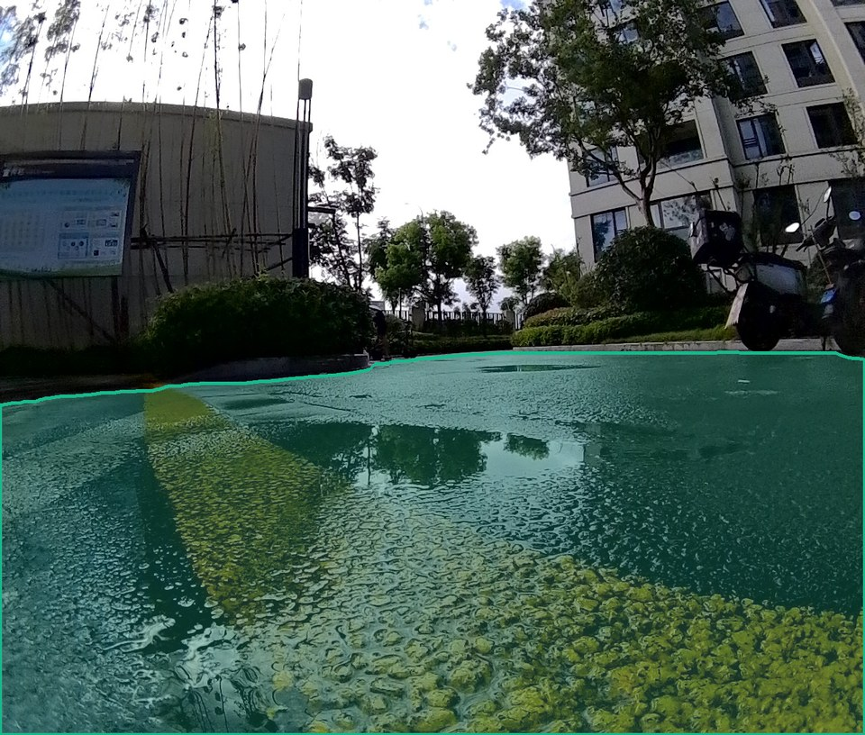

# 02 · 图像预标注

PathSentry Pipeline 的第二阶段：先用 SAM 3.1 提取 `drivable_area`，再用 Qwen2.5-VL 定位道路附近的障碍物，最后将多边形和检测框合并为逐帧标注。这里介绍**当前实现**；模型选型与后续实验计划见 [预标注方案](../docs/02_prelabel.md)。

## 处理流程

```text
采集图像
  ├─ SAM 3.1：可行驶区域分割 ──► drivable_area 多边形
  └─ Qwen2.5-VL：障碍物定位 ───► 检测框、类别、置信度
                               ↓
                         按图像编号合并标注
                               ↓
                         人工检查与修正
```

| 模块 | 代码入口 | 职责 |
|---|---|---|
| 流程编排 | [`ps_proj/custom_prelabel.py`](ps_proj/custom_prelabel.py) | 顺序运行分割和检测，合并逐帧 JSON |
| 区域分割 | [`ps_proj/sam3_1_prelabel/`](ps_proj/sam3_1_prelabel/) | 文本提示、掩码清理、多边形转换 |
| 目标检测 | [`ps_proj/qwen2_5_7B_prelabel/`](ps_proj/qwen2_5_7B_prelabel/) | 道路风险提示词、模型推理、框解析 |
| 示例渲染 | [`tools/render_labelme_examples.py`](tools/render_labelme_examples.py) | 将图像和同名标注绘制成文档预览 |

当前人工检查后的检测类别为 `person` 和 `vehicle`；`drivable_area` 是分割多边形，不计作检测框。模型原始候选类别与人工保留类别的区别见[流程说明](ps_proj/README.md)。

## 标注效果

以下是实际图像与同名标注叠加生成的预览，不是模型精度评测。绿色填充表示 `drivable_area`，红框表示 `person`，黄框表示 `vehicle`。

**行人、停放车辆与道路区域**



**骑行者和车辆**



**仅有可行驶区域的画面**



示例图为缩放后的静态预览；精确坐标和可编辑的形状以对应的 LabelMe JSON 为准。

## 开始使用

运行环境需要 Python、PyTorch/CUDA、SAM 3.1、Qwen2.5-VL 与 vLLM。安装和参数说明见 [`ps_proj/README.md`](ps_proj/README.md)。主脚本接收左右目图像输入、标注输出和模型参数路径；运行前应显式传入当前机器上的路径，避免依赖脚本中的部署机默认值。

```bash
python 02_prelabel/ps_proj/custom_prelabel.py --help
```

输出是按图像文件名配对的 JSON。**当前生成脚本会把来源、置信度等非布尔元数据放入形状的 `flags`；LabelMe 6.x 不能直接读取这种字段。**人工检查前需将这些元数据转入 `description`，并使 `flags` 仅含布尔值。上面的示例采用已兼容的标注。不要将模型原始结果直接视为人工验收后的训练标签。
