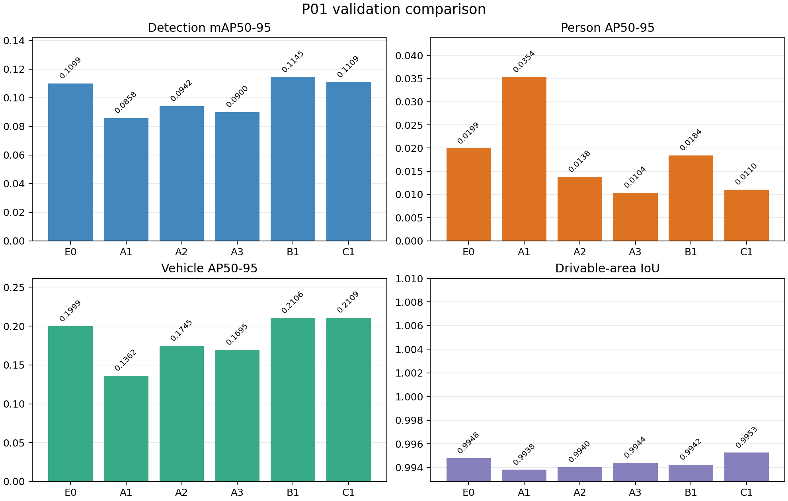
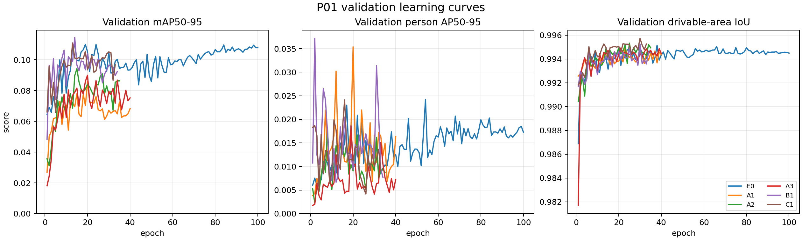
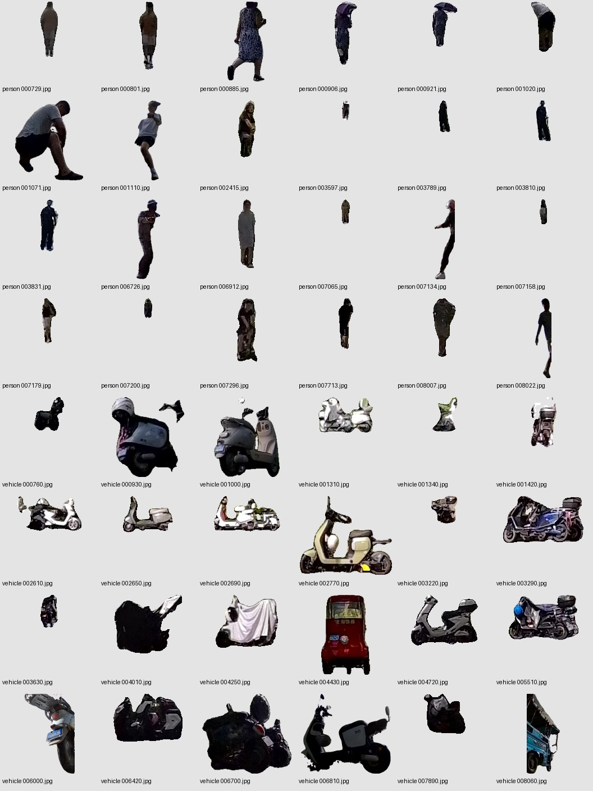
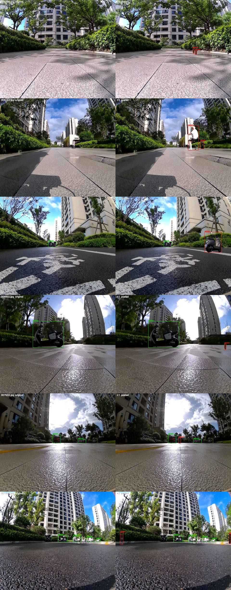

# YOLO11s 多任务模型优化记录

更新日期：2026-10-04。本文持续记录问题、证据、方案、实验和结论。当前 P01 的五组优化实验均已完成。

## 记录约定

- 每个问题用稳定编号 `P01`、`P02`……；问题内的实验用 `P01-A1` 等编号，不复用已有编号。
- 将**已观测结果**与**原因假设**分开记录。每次实验写明数据版本、模型改动、输入尺寸、训练配置、验证指标和产物路径；未运行的实验保留“计划”状态。
- 所有改动与当前展示基线 E0 比较。若更改数据划分，先在新划分上重跑基线，再比较指标。
- 验证集用于选择方案；测试集只在方案确定后评测，不根据测试集调参。每个问题收尾时补充结论与下一步，并在文末变更记录中记一条。

## 当前展示基线：E0

本阶段统一展示 E0 的 `best.pt`，即训练 100 epoch、按验证集综合分数选出的第 24 epoch 权重。模型同时输出 `person`/`vehicle` 检测结果和二值可行驶区域分割结果；输入为 960×832（宽×高），检测使用 YOLO11s 原生 P3/P4/P5 检测头，分割头融合 P2/P3/P4/P5，分割损失权重为 5。

- 权重：[E0 checkpoint manifest](artifacts/p01/checkpoints.md#e0)
- 原始评测结果：[`val_metrics.json`](artifacts/p01/metrics/e0/val_metrics.json)、[`test_metrics.json`](artifacts/p01/metrics/e0/test_metrics.json)
- 数据：训练 5726 张、验证 716 张、测试 716 张；检测类别为 `person` 和 `vehicle`。

| 数据集 | 检测 mAP50 | 检测 mAP50-95 | `person` AP50-95 | `vehicle` AP50-95 | 分割 IoU | 分割 Dice |
| --- | ---: | ---: | ---: | ---: | ---: | ---: |
| 验证集 | 0.2525 | 0.1099 | 0.0199 | 0.1999 | 0.9948 | 0.9974 |
| 测试集 | 0.4443 | 0.1842 | 0.1621 | 0.2063 | 0.9935 | 0.9967 |

**展示口径：**分割 IoU 约 0.99，检测整体 mAP50-95 在验证集为 0.11、测试集为 0.18；验证集的行人检测尤其弱。展示时分别标注数据集，不把测试集较高的数字当成普遍性能。现有划分按时序取段，两个集合的目标尺度和场景难度可能不同；时序相邻帧也会使分割指标偏乐观。以上是当前数据划分下的结果，不能替代跨场景泛化评估。

当前 E1 训练已在完成第 91 epoch 后停止，相关 checkpoint 和日志保留；后续演示与优化比较均以 E0 为基线。

## 问题索引

| 编号 | 问题 | 状态 | 详情 |
| --- | --- | --- | --- |
| P01 | 分割效果较好，检测尤其是小行人效果差 | 实验完成，但问题未解决 | [P01](#p01-检测任务受小目标与数据分布限制) |

## P01 检测任务受小目标与数据分布限制

### 现象与证据

分割任务已经较好收敛，检测任务仍是短板，尤其是远处小行人。训练标注中 `person` 904 个、`vehicle` 4228 个；验证集的 107 个 `person` 框面积均小于原图面积的 1%，而测试集 115 个 `person` 框中有 66 个低于该阈值。这与验证集行人 AP 明显低于测试集一致。小目标在 P3（步长 8）特征图上有效像素少，当前输入缩小到 960×832 后细节进一步减少。

### 原因假设与待核查事项

类别数量、目标尺度与场景分布已有明确差异。素材审核又发现训练图 `000730`、`000750` 中有 `vehicle` 框覆盖一整排车辆；训练图 `007935` 的垃圾桶、`006240` 的电动车也进入了 `person` 素材候选。SAM 的框提示会忠实抠出这些非行人目标，因此素材必须二次审核。**这是训练集标注或实例抠图噪声的直接证据，不等于全量标签错误率**；仍需进一步核查漏标、同类目标框选粒度和遮挡标注的一致性。现有结果不足以证明多任务梯度冲突是检测差的主要原因，因此先做针对检测分辨率和数据的可控实验，暂不同时调整损失函数或任务权重。

### 方案 A：检测 P2 + 高分辨率输入

当前**分割头已有 P2，检测头没有 P2**。在 YOLO11s 检测颈部加入步长 4 的 P2 路径，使检测头从 P2/P3/P4/P5 四个尺度预测；保留原有分割分支和损失定义。能复用的预训练层加载原权重，新增 P2 路径及预测层初始化后训练；检查四尺度特征形状、stride、目标分配、损失和 NMS 输出均正确。

按以下顺序隔离效果：

| 实验 | 检测尺度 | 输入（宽×高） | 目的 |
| --- | --- | --- | --- |
| E0 | P3/P4/P5 | 960×832 | 已完成的对照 |
| P01-A1 | P2/P3/P4/P5 | 960×832 | 单独验证高分辨率检测特征 |
| P01-A2 | P3/P4/P5 | 1280×1088 | 单独验证原图分辨率输入 |
| P01-A3 | P2/P3/P4/P5 | 1280×1088 | 验证两者叠加收益 |

1280×1088 与现有图像原始尺寸一致，仍按现有 letterbox、标签坐标和 mask 最近邻缩放规则处理。高分辨率训练先测试显存占用；若 batch 2 放不下，改为 batch 1 并用梯度累积保持有效 batch 2，再进行正式对比。四组保持同一划分、训练轮次、随机种子、优化器和分割权重 5。

### 方案 B：检测目标 Copy-Paste

当前数据只有检测框和可行驶区域语义 mask，**没有目标实例 mask**。目标是只从训练集建立 `person`、`vehicle` 实例素材库，在训练时贴入其他训练图像；原图、原始标签和验证/测试数据均不覆盖。

**工具选型与限制**

| 工具 | 用途 | 对当前项目的限制 |
| --- | --- | --- |
| [Ultralytics SAM](https://docs.ultralytics.com/models/sam/) | 以现有检测框为提示，离线生成目标实例 mask | 远处小目标、遮挡和密集场景的抠图须抽检；需准备 SAM 权重 |
| [Albumentations `CopyAndPaste`](https://albumentations.ai/docs/api-reference/albumentations/augmentations/mixing/transforms/) | 可用实例 mask 贴图并更新目标标注；也支持仅有框的矩形贴图 | 当前 `yolo` 环境未安装；矩形贴图携带背景，默认随机位置也须按道路场景约束 |
| [Ultralytics Copy-Paste](https://docs.ultralytics.com/guides/yolo-data-augmentation/#copy-paste-augmentations) | 有实例轮廓标签时的内置增强 | 当前检测标签只有框；本项目使用自定义数据加载器，设置其 `copy_paste` 参数不会自动接入 |

**推荐实现路径**

1. 只读取训练集的框和原图，用 SAM 框提示批量产生 `person`、`vehicle` 实例 mask；人工抽检不同大小、遮挡、密集场景，剔除明显抠图错误。另存素材及来源图像/片段、类别、框和 mask 的版本信息。
2. 对相邻视频帧的近重复目标去重，建立训练集专用素材库，重点补足 `person`。先统计素材数量与质量，再定采样比例，避免反复贴少数几个行人。验证集、测试集及其目标不能进入素材库。
3. 在 [`MultiTaskDataset`](scripts/multitask.py) 的训练分支接入增强，或生成独立的版本化训练集；贴图发生在原图坐标系下、letterbox 之前。优先用实例 mask 抠图，以 OpenCV 合成或适配 Albumentations。先试增强概率 0.3、每图 0–2 个目标；这些是待验证初值。
4. 按类别和道路透视约束位置、缩放、亮度、模糊与遮挡：车辆主要放在合理车道位置；行人也可能在路缘或人行区域，不能一律强制贴在可行驶 mask 内。贴后重新计算检测框，检查原有框是否因遮挡而需要修改或移除。保留固定随机种子的增强样本供人工审查。
5. **先核对可行驶区域 mask 的标注口径。**若标注表示遮挡后仍属于道路的道路表面，贴入目标时保持 mask；若表示当前可通行的空闲区域，目标占据像素应改为不可行驶，且原数据也须采用一致口径。对 478 张训练图的抽样检查中，行人框 95.7%、车辆框 97.7% 的框内可行驶像素占比低于 10%；验证/测试集的对应比例也均超过 95%。当前增强实现据此将贴入目标的可见像素标为不可行驶（mask=0），正式训练前仍须目视检查代表性样本。

矩形框 Copy-Paste 只适合低成本可行性试验，不能直接作为正式方案：它容易把原背景贴进新图，产生与目标类别相关的伪线索。SAM 抠图也不是免审核的真值。

### 实验台账

各组保持相同训练/验证划分、最多 100 epoch、随机种子 42、AdamW（初始学习率 0.0003、权重衰减 0.01）、batch 2 和分割权重 5；早停导致实际训练轮次不同。E0 是此前完成的对照。

**Copy-Paste 数据版本：**原始数据集 `dataset/yolo_multitask` 未覆盖；SAM 3.1 只读训练集 461 张候选图，从 677 个框中得到 673 个原始抠图（行人 310、车辆 363），见 [`sam3_1/summary.json`](artifacts/p01/materials/sam3_raw/summary.json)。审核版 [`sam3_1_curated/summary.json`](artifacts/p01/materials/sam3_1_curated/summary.json) 保留行人 165、车辆 309。审核步骤用本机 COCO 预训练 YOLO11s 交叉检查行人候选：行人置信度至少 0.03，目标框与 SAM 抠图框的交集须覆盖较小框的 30%；另设形状、SAM 置信度门槛，并按 [`p01_copy_paste_rejects.json`](scripts/p01_copy_paste_rejects.json) 排除目视确认的错抠片段。车辆移除宽高比超过 2 的成排/残片抠图。阈值只是素材质量启发式，可能排除一些真实小目标；原始素材保留供复核。

训练加载时仅从审核版素材库在线采样：每张图触发概率 0.3，触发后尝试贴入 1–2 个目标，约 80% 选行人；根据来源目标的纵向位置和可行驶区域约束落点，避免与原框明显重叠。固定种子抽测 500 张训练图，134 张成功贴图，新增行人 153、车辆 38 个；这只是抽测实现率，不是每个 epoch 的精确计数。24 组原图/增强图与 mask 一致性检查见 [`previews_curated`](artifacts/p01/materials/previews_curated)。

| 实验 | 改动 | 输入（宽×高） | 数据 | 状态 | 结果/产物 |
| --- | --- | --- | --- | --- | --- |
| E0 | 原 P3/P4/P5 检测 | 960×832 | 原始训练集 | 已完成 | 本文基线 |
| P01-A1 | 检测头增加 P2 | 960×832 | 原始训练集 | 已完成 | 最佳 epoch 20；mAP50-95 0.0858，`person` 0.0354，IoU 0.9938；[`val_metrics.json`](artifacts/p01/metrics/a1/val_metrics.json) |
| P01-A2 | 仅提高分辨率 | 1280×1088 | 原始训练集 | 已完成 | 最佳 epoch 15；mAP50-95 0.0942，`person` 0.0138，IoU 0.9940；[`val_metrics.json`](artifacts/p01/metrics/a2/val_metrics.json) |
| P01-A3 | P2 + 高分辨率 | 1280×1088 | 原始训练集 | 已完成 | 最佳 epoch 20；mAP50-95 0.0900，`person` 0.0104，IoU 0.9944；[`val_metrics.json`](artifacts/p01/metrics/a3/val_metrics.json) |
| P01-B1 | 仅 Copy-Paste | 960×832 | 审核版训练素材在线增强 | 已完成 | 最佳 epoch 14；mAP50-95 0.1145，`person` 0.0184，IoU 0.9942；[`val_metrics.json`](artifacts/p01/metrics/b1/val_metrics.json) |
| P01-C1 | A2 高分辨率 + Copy-Paste | 1280×1088 | 同上 | 已完成 | 最佳 epoch 13；mAP50-95 0.1109，`person` 0.0110，IoU 0.9953；[`val_metrics.json`](artifacts/p01/metrics/c1/val_metrics.json) |

**验证集结果汇总。**“训练/最佳”分别是停止轮次与所选 checkpoint 的轮次；时延为同一 RTX 4090 上 batch 1、32 张固定验证图的模型前向与 NMS 均值，显存为该基准过程的峰值 CUDA 分配量，并非训练显存。

| 实验 | 训练/最佳 epoch | mAP50 | mAP50-95 | `person` AP50-95 | `vehicle` AP50-95 | 分割 IoU | 时延 ms | 峰值 MiB |
| --- | ---: | ---: | ---: | ---: | ---: | ---: | ---: | ---: |
| E0 | 100/24 | 0.2525 | 0.1099 | 0.0199 | 0.1999 | 0.9948 | 3.50 | 513 |
| P01-A1 | 40/20 | 0.2209 | 0.0858 | **0.0354** | 0.1362 | 0.9938 | 5.11 | 565 |
| P01-A2 | 35/15 | 0.2036 | 0.0942 | 0.0138 | 0.1745 | 0.9940 | 5.40 | 859 |
| P01-A3 | 40/20 | 0.2047 | 0.0900 | 0.0104 | 0.1695 | 0.9944 | 8.28 | 948 |
| P01-B1 | 34/14 | 0.2469 | **0.1145** | 0.0184 | 0.2106 | 0.9942 | 3.50 | 513 |
| P01-C1 | 33/13 | 0.2512 | 0.1109 | 0.0110 | **0.2109** | **0.9953** | 5.41 | 859 |

本轮验证集最佳候选权重：[B1 checkpoint manifest](artifacts/p01/checkpoints.md#b1)。其余组权重、训练历史、基准结果与固定样本预测图保存在本机对应的 `runs/p01/<实验编号>/` 目录；可提交到 Git 的轻量副本见 [`artifacts/p01`](artifacts/p01/README.md)。

### 可视化结果

下面两张图直接由各组保存的 `val_metrics.json` 和 `history.jsonl` 生成，脚本为 [`plot_p01_results.py`](scripts/plot_p01_results.py)。图中 E0 仍是展示基线，B1 是本轮验证集整体检测指标最好的优化候选。



图 1：五组结构/数据实验的验证集检测和分割指标。A1 的行人 AP 峰值没有转化为整体检测提升；B1 的整体 mAP50-95 最高，但行人 AP 仍略低于 E0。



图 2：各组训练过程的验证曲线。行人 AP 在不同轮次和不同实验间波动明显，未形成稳定的提升趋势；分割 IoU 很快稳定在约 0.994–0.995，说明当前瓶颈仍是检测任务。



图 3：审核版 SAM 3.1 抠图素材。原始 673 个抠图经过交叉检查和目视审核后保留 474 个；该素材库的行人来源仍集中在有限时间段，不能代表新的独立场景。



图 4：固定随机种子的 Copy-Paste 原图/增强图对照。新增框、合成图像和可行驶区域 mask 已同步更新；完整预览见 [`previews_curated`](artifacts/p01/materials/previews_curated)。

验证集选定 B1 后，仅对 B1 做本轮测试集评测；E0 测试结果为之前保存的对照。测试集未用于选择结构、素材或训练参数。

| 测试集模型 | mAP50 | mAP50-95 | `person` AP50-95 | `vehicle` AP50-95 | 分割 IoU | 分割 Dice |
| --- | ---: | ---: | ---: | ---: | ---: | ---: |
| E0 | 0.4443 | 0.1842 | 0.1621 | 0.2063 | 0.9935 | 0.9967 |
| P01-B1 | 0.5924 | 0.2856 | 0.2819 | 0.2893 | 0.9931 | 0.9965 |

B1 测试集完整结果见 [`test_metrics.json`](artifacts/p01/metrics/b1/test_metrics.json)。相对 E0，测试集 mAP50-95 高 0.1014、行人 AP50-95 高 0.1198、车辆 AP50-95 高 0.0829，分割 IoU 低 0.0003。测试集比验证集容易，不能把这个差值解释成跨场景泛化收益。

### 评估与决策规则

每组最多训练 100 epoch；验证综合分数 `(mAP50-95 + 分割 IoU) / 2` 连续 20 epoch 不提升时提前停止，并记录实际训练轮次与最佳轮次。A1 启动时设的是 `--patience 101`，达到上述条件时由实验监控在完整 checkpoint 保存后终止。每组记录整体与分类别 AP50/AP50-95、Recall、分割 IoU/Dice、推理延迟、峰值显存和固定样本预测图；详细分类别指标见各组 `val_metrics.json`，按目标面积分桶的检测分析留待标签核查后进行。方案选择以**验证集整体检测 mAP50-95**优先，同时查看 `person` AP50-95，并要求分割 IoU 相比 E0 绝对下降不超过 0.005。先完成单因素实验，再做组合；验证集确定方案后再看测试集。若重新按场景/录制序列划分数据，须在新划分上重跑 E0。

### 当前结论与下一步

状态：**五组实验、素材审核、验证集评测和 B1 测试集评测均已完成；P01 当前问题未解决**。当前展示基线仍为此前约定的 E0；按验证集整体 mAP50-95，B1 是本轮优化后的最优候选，但它没有改善验证集行人 AP，因此不自动替换展示模型。

A1 因综合分数连续 20 个 epoch 未提升，在完整保存第 40 epoch 后停止；其第 20 epoch 最佳权重相对 E0 提高了行人 AP50-95（0.0199→0.0354），但降低了整体 mAP50-95（0.1099→0.0858）与车辆 AP50-95（0.1999→0.1362），不能选作目前最优整体模型。同输入下 A1 推理均值 5.11 ms、峰值 CUDA 分配 564.8 MiB；E0 对应为 3.50 ms、513.3 MiB，均为 batch 1、32 张验证图、模型前向加 NMS 的同口径测量。固定样本预测图保存在 [contact_00.jpg](artifacts/p01/visuals/a1/contact_00.jpg) / [contact_01.jpg](artifacts/p01/visuals/a1/contact_01.jpg)。

A2 在第 35 epoch 自动早停，最佳为第 15 epoch。整体 mAP50-95 0.0942、行人 0.0138、车辆 0.1745、IoU 0.9940，仍低于 E0。batch 1 推理均值 5.40 ms、峰值 CUDA 分配 858.5 MiB；固定样本图在 [contact_00.jpg](artifacts/p01/visuals/a2/contact_00.jpg) / [contact_01.jpg](artifacts/p01/visuals/a2/contact_01.jpg)。

A3 在第 40 epoch 自动早停，最佳为第 20 epoch。整体 mAP50-95 0.0900、行人 0.0104、车辆 0.1695、IoU 0.9944；batch 1 推理均值 8.28 ms、峰值 CUDA 分配 948.1 MiB；固定样本图在 [contact_00.jpg](artifacts/p01/visuals/a3/contact_00.jpg) / [contact_01.jpg](artifacts/p01/visuals/a3/contact_01.jpg)。A 组均满足分割 IoU 下降不超过 0.005 的约束，但整体检测均未超过 E0。A1 的行人 AP 提升值得保留为诊断结果；按预先约定的整体检测 mAP50-95 优先规则，C1 采用 A 组最高的 A2 高分辨率结构，与 B1 一起检验 Copy-Paste 的增量。

B1 在第 34 epoch 自动早停，最佳为第 14 epoch。整体 mAP50-95 0.1145，比 E0 高 0.0046；车辆 AP50-95 0.2106，比 E0 高 0.0107；行人 AP50-95 0.0184，比 E0 低 0.0015。分割 IoU 0.9942，比 E0 低 0.0006，满足约束。同输入 batch 1 推理均值 3.50 ms、峰值 CUDA 分配 513.3 MiB，几乎与 E0 相同；固定样本图在 [contact_00.jpg](artifacts/p01/visuals/b1/contact_00.jpg) / [contact_01.jpg](artifacts/p01/visuals/b1/contact_01.jpg)。Copy-Paste 提高了目前的整体检测，但尚未解决行人检测短板。

C1 在第 33 epoch 自动早停，最佳为第 13 epoch。整体 mAP50-95 0.1109，比 B1 低 0.0036，行人 AP50-95 0.0110 也更低；分割 IoU 0.9953。batch 1 推理均值 5.41 ms、峰值 CUDA 分配 858.5 MiB；固定样本图在 [contact_00.jpg](artifacts/p01/visuals/c1/contact_00.jpg) / [contact_01.jpg](artifacts/p01/visuals/c1/contact_01.jpg)。A1/A2/A3 与 E0、C1 与 B1 的对照表明，此次单纯提高输入尺寸、增加 P2 检测路径，以及把高输入与 Copy-Paste 组合，都没有稳定改善当前验证集的行人检测。B1 在测试集上明显优于 E0，但验证集行人 AP 并未提高；这两个观察必须同时保留。

**当前最优权重说明：**若“最优”按本轮验证集整体检测 mAP50-95 定义，使用 [B1 checkpoint manifest](artifacts/p01/checkpoints.md#b1)，对应 B1（960×832 + 审核版 Copy-Paste，最佳 epoch 14）。若“最优”要求行人 AP 优先，A1 的行人 AP50-95 最高（0.0354），但其整体 mAP50-95 只有 0.0858、车辆 AP 下降，不能作为本轮通用最优模型。展示和后续对比仍使用 [E0 checkpoint manifest](artifacts/p01/checkpoints.md#e0)，直到完成下一轮数据/划分核查。

因此，P01 的结论是：**分割任务已经稳定，整体检测通过 Copy-Paste 得到小幅改善，但远处小行人检测问题没有解决。**当前结果不足以支持把 B1 宣布为稳定泛化模型，下一轮应先处理错标、漏标、遮挡一致性和按场景重新划分数据，再重复 E0/B1 对照。

**下一轮优先事项：**先复核训练/验证集中 `person` 错标、漏标与遮挡框一致性，尤其本轮审核标出的异常片段；再以录制序列或场景为分组重新划分数据，在新划分上重跑 E0 与 B1。B1 的验证集整体增益只有 0.0046，需重复随机种子确认稳定性。审核版行人素材只有 26 个百帧时间段的来源，后续扩大独立行人场景并评估目标面积分桶召回，才适合进一步讨论更强的 P2 结构或任务权重调整。

## 后续问题记录模板

新增问题时复制以下结构，更新问题索引，并把每次实验写进该问题的实验台账；不要覆盖旧结果。

```markdown
## PXX 问题名称

### 现象与证据
指标、样本、日志及其路径；注明数据划分和模型版本。

### 原因假设与待核查事项
区分已证实事实和猜测。

### 方案
改动位置、数据处理、依赖和风险。

### 实验台账
| 实验 | 改动 | 数据/训练配置 | 状态 | 验证结果 | 产物 |
| --- | --- | --- | --- | --- | --- |

### 评估与决策规则
主指标、约束指标、对照组和测试集使用规则。

### 结论与下一步
结论、未解决问题和后续行动。
```

## 变更记录

| 日期 | 记录 |
| --- | --- |
| 2026-10-04 | 选定 E0 为展示基线；记录 P01 的现状、P2/高分辨率与 Copy-Paste 方案，以及待实施实验。 |
| 2026-10-04 | 实现 P2 检测模型、SAM 3.1 素材提取脚本和训练侧 Copy-Paste；启动 A1，扩大抽样检查分割 mask 的目标覆盖口径。 |
| 2026-10-04 | A1 在第 40 epoch 按 20-epoch 无提升规则停止，最佳为第 20 epoch；行人 AP 提高，整体检测下降，结果和固定样本图已保存。 |
| 2026-10-04 | A2 在第 35 epoch 自动早停，最佳为第 15 epoch；单独提高输入尺寸后，整体与行人 AP 仍低于 E0。 |
| 2026-10-04 | A3 在第 40 epoch 自动早停，最佳为第 20 epoch；P2 与高输入叠加后整体检测仍低于 E0。C1 选 A2 结构作为 A 组内最优整体检测对照。 |
| 2026-10-04 | SAM 3.1 从训练集提取 673 个抠图，经 YOLO 交叉检查和目视审核保留 474 个；记录疑似错标目标、贴图预览及抽测实现率。 |
| 2026-10-04 | B1 在第 34 epoch 自动早停，最佳为第 14 epoch；整体检测小幅提升，行人 AP 未提升，分割 IoU 保持稳定。启动 C1。 |
| 2026-10-04 | C1 在第 33 epoch 自动早停，最佳为第 13 epoch；验证集整体与行人 AP 均低于 B1。按验证集选 B1 做一次测试集评测，完整结果与数据局限已汇总。 |
| 2026-10-04 | P01 收尾：生成验证指标柱状图、训练曲线和素材预览；确认 B1 是验证集整体检测最优候选，但行人检测问题仍未解决，E0 继续作为展示基线。 |
