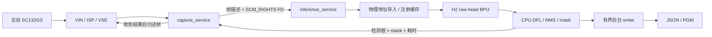

# 06 · RDK-X5 端侧部署

本阶段将 05_quantization 的 H2 raw-head 检测/分割模型部署到 RDK-X5，实现左目摄像头采集、VSE 预处理、跨进程输入内存共享、BPU 推理和 CPU 后处理。工程使用 C++17，作为独立构建目标维护；第三方头文件与运行库统一复用与 `06_deploy/` 同级的 `../3rdlibrary/`，运行时不依赖训练工程或 Python 环境。迁移工程时需同时保留 `06_deploy/` 和同级第三方目录。

## 阶段结论

当前固化方案为 **15 Hz、同板双进程、单帧在途、普通 CPU 调度、CPU/BPU performance、异步日志与异步结果保存**。默认配置集中在 [configs/rdk_x5.env](configs/rdk_x5.env)，启动脚本自动加载，命令行环境变量可覆盖。

已完成三组共 5,400 帧对照测试。最终配置的 1,785 个稳态样本中，取帧调用至结果返回 P99 为 **40.701 ms**、最大 **43.071 ms**，实际返回率约 **14.984 Hz**。完整结果见 [稳定性报告](reports/stability_20261007.md)。模型、已验证二进制及配置指纹记录在 [基线清单](reports/deployment_baseline_20261007.json)。

当前交付覆盖左目检测与二值分割，不包含右目推理、深度融合、ROS 接口、开机自启和服务崩溃自动恢复。测试使用当前摄像头场景，未覆盖密集目标和长时间热稳定性；含启动的最大耗时为 75.899 ms，不能把稳态指标视为冷启动保证。

## 目录结构

```text
06_deploy/
├── README.md
├── CMakeLists.txt                       # C++17/aarch64 构建目标
├── build.sh                            # 构建入口
├── configs/
│   └── rdk_x5.env                      # 已验证的默认运行参数
├── models/
│   └── h2_raw_head.bin                 # 固定输入、7 输出的 BPU 模型
├── include/                           # 帧、协议、推理、日志和结果 writer 接口
├── src/
│   ├── capture_service.cpp            # 采集、发送、结果接收及帧回收
│   ├── inference_service.cpp          # 接收、推理、回传与保存调度
│   ├── vio_pipeline.cpp               # 左目 VIO/VSE 初始化与资源管理
│   ├── raw_head_runner.cpp            # 输入注册、BPU、DFL/NMS/分割
│   ├── socket_protocol.cpp            # Unix socket 协议与 FD 传递
│   └── logger.cpp                     # 有界异步日志
├── scripts/perf/
│   ├── build.sh                       # 转发到工程构建入口
│   ├── deploy.sh                      # 上传程序、模型和运行库
│   ├── run.sh                         # 加载基线配置并启动两个服务
│   └── pull_logs.sh                   # 拉取日志和结果文件
├── tests/runtime_workers_test.cpp     # 输出副本、日志并发与退出排空验证
├── reports/                           # 可随 Git 展示的报告和数值汇总
├── build_aarch64/                      # 编译产物，Git 忽略
└── logs/                              # 原始测试日志，Git 忽略
```

共享依赖在仓库根目录，与本工程同级：

```text
CV_pipeline/
├── 3rdlibrary/
│   ├── DNN/{include,lib,bin}/          # DNN/HBRT/hbmem
│   ├── RDK_CAMERA/{include,lib}/       # camera/VIN/ISP/VSE SDK
│   └── opencv_aarch64/                # 其他阶段使用，本工程未链接
└── 06_deploy/
```

当前 CMake 链接共享目录中的 DNN 和 RDK_CAMERA，不依赖 OpenCV。部署脚本从共享目录复制这两组运行库，头文件仅供编译使用。根目录 `3rdlibrary/` 沿用仓库 Git 忽略规则，新检出环境需另行准备 SDK 文件。已核对本阶段原副本的 275 个文件/软链接与共享目录完全一致，无需补充，目录内重复副本已删除。

## 系统架构



- `capture_service` 创建 Unix domain socket 服务端，推理进程连接后初始化左目 VIO，按 15 Hz 取帧并发送描述。
- `inference_service` 是 socket 客户端；导入输入内存、执行模型、完成后处理，然后先回传结果，再提交后台文件保存。
- 两个服务必须运行在**同一块板、同一内核**下。Unix socket 路径为 `/tmp/cv_pipeline_left.sock`；`SCM_RIGHTS` 和物理地址导入不能直接替换成跨机器 TCP 通信。
- socket 不传 NV12 图像字节；返回的检测框和 mask 是普通 socket 数据。异步保存会复制输出结果，不影响输入零拷贝。

### 线程、缓冲区与生命周期

| 组件 | 工作方式 | 阻塞与容量策略 |
|---|---|---|
| 采集主线程 | 取帧、发送 FD/描述、控制发送节奏 | 默认 1 帧在途，最大支持 2；容量满时等待，迟到后不突发追赶旧 deadline |
| 结果接收线程 | 接收结果、匹配 frame id、归还 VSE buffer | 正常情况下 BPU 完成并返回结果后才释放输入帧 |
| 推理主线程 | 接收、BPU、CPU 后处理、回传 | 单路推理；结果对象循环复用，7 个输出 tensor 预分配 |
| 文件 writer | 后台保存 JSON/PGM | 8 个预分配输出槽位；满时跳过文件快照并计数，已回传结果不受影响 |
| 日志 worker | 后台写文件和 stderr | 队列容量 1024，约 100 ms 批量刷新；满时丢诊断消息并记录数量 |

VSE buffer 按物理地址首次调用 `hb_mem_import_com_buf_with_paddr` 和 `hbSysRegisterMem`，随后缓存复用，避免每帧导入/注册。正常有限帧运行结束时，采集端排空在途队列并归还帧，再停止 VIO；推理端释放 task、注册缓存、输出 tensor 和模型，后台 writer 与 logger 排空后退出。

当前没有断线重连状态机；进程异常后应检查日志并成对重启。后台保存不保证异常断电时文件完整，连续运行也没有文件自动轮转。

## 模型与数据接口

| 项目 | 固定接口 |
|---|---|
| 模型 | `models/h2_raw_head.bin`，来源为 05_quantization 的 H2 raw-head |
| 原始输入 | 左目 1088×1280 |
| VSE ROI | `x=0, y=169, w=1088, h=942` |
| 模型输入 | batch 1，960×832 NV12；尺寸按宽×高表示 |
| 检测输出 | 三尺度 cls/bbox logits，输出索引成对为 `(0,1)`、`(2,3)`、`(4,5)` |
| 分割输出 | 索引 6，240×208 logits |
| 后处理 | strides `(8,16,32)`，DFL 16 bins，sigmoid，按类别 NMS；最多保留 100 个检测框 |
| 阈值 | 检测 score=0.25，NMS IoU=0.45，分割 sigmoid > 0.5 |
| 结果 mask | 240×208，uint8，背景 0、前景 255 |

模型输出顺序、布局和解码方式与当前 `.bin` 配套，不是任意 YOLO 模型的通用加载器。替换模型、输入尺寸、ROI 或输出定义时，应一起修改 [VIO 配置](src/vio_pipeline.cpp)、[推理后处理](src/raw_head_runner.cpp) 和 [类型定义](include/deploy_types.hpp)，重新验证。

### socket 协议

协议定义在 [socket_protocol.hpp](include/socket_protocol.hpp)：

- 请求：`FrameHeader`，包含版本、frame id、时间戳、plane 布局、FD 数量、share id 和物理地址；FD 通过 `SCM_RIGHTS` 传递。
- 响应：`ResultHeader`、检测框数组、49,920 字节 mask；头部包含 import/BPU/infer/post 耗时。
- 协议使用本地 C++ 结构体布局，当前版本为 1。没有跨架构序列化约定，修改结构体需同时更新两端。

### 结果文件与坐标系

板端输出目录默认是 `/opt/cv_pipeline/logs/results/`：

```text
frame_<id>.json      # frame_id、infer_ms、post_ms、detections
frame_<id>.pgm       # P5，240×208，8 位二值 mask
```

JSON 示例（数值仅示意）：

```json
{"frame_id": 100, "infer_ms": 35.5, "post_ms": 4.2, "detections": []}
```

非空检测项包含 `class`、`score` 和 `xyxy`；类别编号需使用训练模型对应的映射。`infer_ms=import_ms+bpu_ms`，不是完整端到端耗时。

检测框坐标对应 960×832 模型输入。恢复到当前原始左目坐标时，使用 `x_raw=x*1088/960`、`y_raw=169+y*942/832`。mask 如需叠加到原图，应先按 ROI 尺寸最近邻放大，再放回原图 ROI；ROI 外没有分割预测。换相机或改裁剪后需同步更新映射。

## 环境与构建

以下命令除单独说明外，都从 `06_deploy/` 执行。

| 环境 | 要求 |
|---|---|
| 主机 | Bash、Docker、SSH/SCP、sshpass；构建镜像已存在 |
| 工具链镜像 | `openexplorer/ai_toolchain_ubuntu_20_x5_cpu:v1.2.8`，linux/amd64 |
| 编译器 | 镜像内 aarch64 GNU 11.3，C++17，CMake Release |
| 端侧 | RDK-X5/aarch64、已匹配的 camera/BPU 驱动及设备树、可工作的左目摄像头 |
| 权限 | 当前脚本使用 root，涉及 camera/hbmem 和 CPU/BPU governor 设置 |

### 推荐：固定镜像构建

```bash
cd 06_deploy

docker run --rm --platform linux/amd64 \
  -v "$PWD":/workspace/06_deploy \
  -v "$PWD/../3rdlibrary":/workspace/3rdlibrary:ro \
  -w /workspace/06_deploy \
  openexplorer/ai_toolchain_ubuntu_20_x5_cpu:v1.2.8 bash -lc \
  'export PATH=/cmake-3.14.5-Linux-x86_64/bin:/opt/arm-gnu-toolchain-11.3.rel1-x86_64-aarch64-none-linux-gnu/bin:$PATH; CXX=aarch64-none-linux-gnu-g++ CC=aarch64-none-linux-gnu-gcc ./build.sh'
```

也可执行 `./build.sh`。它在找不到本机 CMake 时自动使用镜像；若本机已有 CMake，则需要自行提供 aarch64 `CC/CXX`。macOS 已安装 CMake 但没有交叉编译器时，请使用上面的显式 Docker 命令。

产物为 `build_aarch64/capture_service`、`build_aarch64/inference_service`。构建脚本会重建输出目录；CMake 的 `THIRD_PARTY_ROOT` 默认是 `../3rdlibrary`，`DNN_ROOT`、`CAMERA_ROOT` 分别指向其 DNN、RDK_CAMERA 子目录。构建和部署脚本均支持通过 `THIRD_PARTY_ROOT=/绝对路径/3rdlibrary` 覆盖共享根目录；Docker 自动构建会将该目录只读挂载到容器的同级路径。

## 部署与运行

### 1. 上传程序、模型和运行库

先停止旧服务，再执行部署，避免覆盖运行中的可执行文件。

```bash
BOARD_PASSWORD=root scripts/perf/deploy.sh
```

默认 `BOARD=root@192.168.1.12`、`REMOTE=/opt/cv_pipeline`。端侧布局：

```text
/opt/cv_pipeline/
├── bin/{capture_service,inference_service}
├── models/h2_raw_head.bin
├── 3rdlibrary/{DNN,RDK_CAMERA}/lib/
└── logs/
    ├── capture.log
    ├── inference.log
    └── results/
```

`configs/rdk_x5.env` 和运行脚本在主机侧加载，当前部署脚本从主机的同级 `../3rdlibrary` 读取依赖，上传到端侧 `$REMOTE/3rdlibrary`。端侧目录是运行包的库位置，与主机源码目录布局不同；脚本不安装 systemd 服务。

### 2. 有限帧验证

```bash
BOARD_PASSWORD=root FRAMES=600 scripts/perf/run.sh
```

脚本后台启动两个进程并返回，不等待 600 帧全部完成。大约 40 秒处理时间之外还需启动与退出时间；应以日志确认结束：

```bash
ssh root@192.168.1.12 'tail -n 5 /opt/cv_pipeline/logs/capture.log; tail -n 5 /opt/cv_pipeline/logs/inference.log'
```

正常结束应包含：

```text
capture service stopped produced=600 completed=600
result writer stopped written=600 dropped=0 errors=0
```

每次启动会终止已有同名服务并清空旧日志、旧 JSON/PGM；需要保留时先拉取。日志、文件可能稍晚于 socket 结果可见，应等待 writer 退出再完整归档。

### 3. 拉取日志和结果

```bash
BOARD_PASSWORD=root OUT=logs/board_run scripts/perf/pull_logs.sh
```

检查两个日志文件、JSON/PGM 数量和 writer 统计。默认本地归档目录为 `logs/board_<时间>/`。

### 4. 连续运行与停止

```bash
# 连续推理，关闭文件快照；检测框/mask 仍通过 socket 返回。
BOARD_PASSWORD=root FRAMES=0 SAVE_RESULTS=off scripts/perf/run.sh
```

持续运行如需保存所有帧，可使用 `SAVE_RESULTS=async`，但需另行管理磁盘空间和日志轮转。当前进程不是守护服务；现场发布还应补充重连、异常退出和存储管理策略。

可向采集进程发送 SIGTERM 请求停止，然后确认两个进程均已退出：

```bash
ssh root@192.168.1.12 'pkill -TERM -x capture_service || true'
ssh root@192.168.1.12 'ps -eo pid,args | grep -E "[c]apture_service|[i]nference_service"'
```

成对重启使用 `run.sh`。有限帧测试的退出与写盘排空已验证；异常中断不作为结果完整性保证。

## 默认配置与覆盖

[configs/rdk_x5.env](configs/rdk_x5.env) 固化性能基线，外部环境变量优先。它不包含板端密码。

| 参数 | 默认值 | 说明 |
|---|---|---|
| `WARMUP` | `5` | 丢弃 5 个摄像头帧，不执行模型预热 |
| `QUEUE_CAPACITY` | `1` | 最大在途帧数；程序限制为 1–2 |
| `CAPTURE_CPUS` | `2-3` | 采集进程 CPU 亲和性 |
| `INFERENCE_CPUS` | `0-7` | 推理及其内部线程可使用的 CPU |
| `RT_PRIORITY` | `0` | 普通调度；大于 0 使用 SCHED_RR |
| `CPU_GOVERNOR` | `performance` | `schedutil` 恢复动态调频；`keep` 不修改当前设置 |
| `SAVE_RESULTS` | `async` | `async` 后台保存；`sync` 同步对照；`off` 不保存文件 |
| `LOG_LEVEL` | `info` | 可选 `debug`；不关闭逐帧耗时日志 |
| `INFERENCE_START_DELAY` | `1` | 两进程启动间隔，秒，不是模型就绪握手 |
| `FRAMES` / `CAMERA_HOST` | `100` / `0` | 启动脚本参数：帧数、左目 host |
| `BOARD` / `REMOTE` | `root@192.168.1.12` / `/opt/cv_pipeline` | 连接地址、部署根目录 |
| `BIN_DIR` | `$REMOTE/bin` | 指定备份程序做版本对照 |

BPU governor 在启动脚本中设为 performance。CPU/BPU governor 的修改作用于板端，并在进程结束后保留；CPU performance 本次为 1.5 GHz，可能增加功耗，实际功耗未测，温控仍生效。

对照测试示例：

```bash
BOARD_PASSWORD=root FRAMES=600 CPU_GOVERNOR=schedutil scripts/perf/run.sh
BOARD_PASSWORD=root FRAMES=600 SAVE_RESULTS=sync scripts/perf/run.sh
BOARD_PASSWORD=root FRAMES=100 LOG_LEVEL=debug scripts/perf/run.sh
```

`--hz`、`--score`、`--nms` 等程序参数不在主机运行脚本的环境变量接口中；手工运行二进制时可指定，修改后需重新验证性能/精度。基线处理率固定为 15 Hz。

## 性能验收与耗时口径

旧程序、异步 I/O、异步 I/O + CPU performance 三组各跑 3×600 帧；每轮排除前 5 个实际推理样本，最终每组 1,785 帧。下表单位 ms，优化前使用相同的新调度参数：

| 环节 | 优化前 P99 / 最大 | 固化方案 P99 / 最大 |
|---|---:|---:|
| BPU API | 41.383 / 45.168 | 35.765 / 36.065 |
| CPU 后处理 | 7.631 / 21.276 | 4.381 / 4.627 |
| 取帧调用至结果返回 | 51.006 / 673.409 | 40.701 / 43.071 |

最终返回间隔 P99=67.117 ms、最大=69.706 ms，实际返回率约 14.984 Hz；稳态样本没有 e2e 超过 66.667 ms。含启动的最大 e2e 为 75.899 ms。测试现场检测数为 0，不能外推为密集目标下的最坏情况保证。

后台写盘最大出现 162.603 ms，未阻塞结果回传；CPU governor 对照将后处理 P99 从 21.215 ms 降至 4.381 ms。数据支持异步 I/O 和 CPU 性能模式对当前场景有效，不等于证明 BPU 硬件利用率或 DDR 争用的根因。

| 日志字段 | 计时范围 |
|---|---|
| `acquire_ms` / `send_ms` | VSE 取帧调用 / 帧描述与 FD 发送 |
| `queue_wait_ms` | 发送前等待队列容量和获取状态锁 |
| `import_ms` | 首次导入和注册输入内存；命中缓存为 0 |
| `submit_ms` / `task_wait_ms` / `task_release_ms` | SDK 提交 / 等待完成 / task 释放 |
| `bpu_ms` | 上述三段总墙钟耗时，包含运行时调度，不是纯硬件时间 |
| `cache_ms` / `post_ms` | 输出缓存失效 / CPU 解码、NMS 和 mask |
| `result_send_ms` | 检测框、mask 回传 |
| `persist_submit_ms` / `file_write_ms` | 保存提交开销 / 后台实际文件写入 |
| `state_lock_ms` / `frame_release_ms` | 结果接收后获取帧状态 / 归还 VSE buffer |
| `result_wait_ms` | 发送完成到接收结果，含排队和对端处理 |
| `e2e_ms` | 取帧调用开始到结果接收完成，不含曝光、上游驻留和发送前容量等待 |
| `result_interval_ms` | 相邻结果到达间隔，用于验证输出节奏 |
| `recv_wait_ms` | 推理端等待下一帧的时间，包括空闲，不计作推理耗时 |

详见 [稳定性报告](reports/stability_20261007.md)、[数值汇总](reports/stability_20261007.json)；前期参数对照保留在 [历史报告](reports/scheduling_comparison_20261007.md)。原始日志位于 `logs/`，报告和 JSON 汇总可以随 Git 展示。

## 验证与排障

主机上的工作线程测试不依赖板端 SDK：

```bash
c++ -std=c++17 -pthread -Iinclude \
  tests/runtime_workers_test.cpp src/logger.cpp -o /tmp/cv-runtime-workers-test
/tmp/cv-runtime-workers-test
```

测试覆盖后台输出持有独立副本、源结果复用、多线程日志以及退出排空。端侧验收还应检查 produced/completed、writer dropped/errors、JSON/PGM 数量及实际结果返回间隔。

| 现象 | 优先检查 |
|---|---|
| VIO 初始化或取帧失败 | 左目 host、SC132GS 连接、设备树、其他进程占用；查看 capture.log 与板端驱动日志 |
| 模型加载或输出数失败 | 是否为本工程 7 输出 H2 raw-head；核对基线 SHA256 与 DNN/HBRT 库版本 |
| 动态库找不到 | `$REMOTE/3rdlibrary/{DNN,RDK_CAMERA}/lib` 是否完整；启动脚本是否设置 LD_LIBRARY_PATH |
| socket 连接失败 | 两端路径一致、采集服务是否启动；当前不支持跨机器 FD 传递 |
| 后处理升到约 20 ms | CPU governor 是否仍为 performance、是否温控降频或存在其他 CPU 负载 |
| e2e 大但 BPU/post 正常 | 比较 queue_wait、state_lock、结果间隔；检查是否改回同步写盘或旧版本日志实现 |
| 文件少于结果帧数 | 是否 SAVE_RESULTS=off、writer 是否排空、dropped/errors、剩余磁盘空间 |
| 框/mask 与原图错位 | 模型输入坐标、VSE ROI 和原图映射是否一致 |

当前成功运行后会保留性能 governor，不会自动恢复动态调频。需要恢复时，可在下一次启动传入 `CPU_GOVERNOR=schedutil`，或在板端执行：

```bash
echo schedutil > /sys/devices/system/cpu/cpufreq/policy0/scaling_governor
```

部署基线只固化已经验证的功能和参数；实车长时运行、异常恢复、日志/结果轮转与密集目标压力测试应单独验收。
